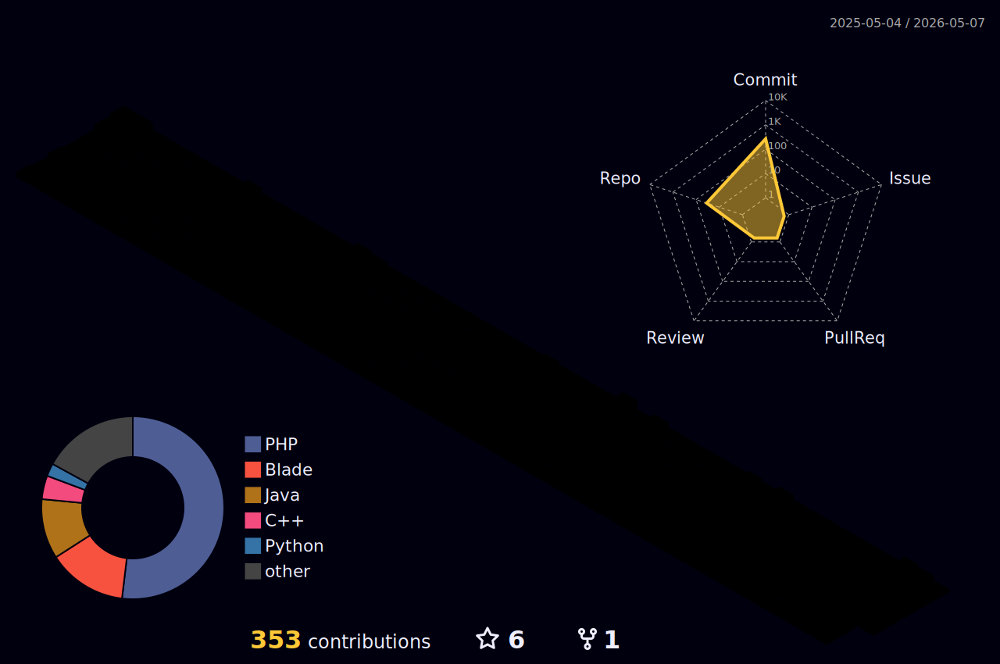

  

 

  

    Desenvolvedor com foco principal em <b>Backend</b> (PHP/Laravel). 
    Também possuo habilidades em <b>Frontend</b> e <b>UI Design</b>, o que me permite ter uma visão completa do ciclo de desenvolvimento, desde o banco de dados até a interface final.
      
    <b>Stack Principal:</b> PHP, Laravel, MySQL, API REST 
    <b>Foco Técnico:</b> Clean Code, Modelagem de Dados e Otimização
  

 

  <h3>Tecnologias</h3>
  
  

    
  

  
  

    
  

 

  
  
   

 

  

